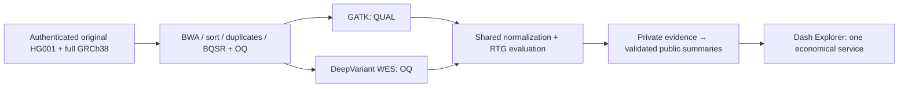

# Five-minute GIAB WES demonstration

Prepared September 11 UTC / September 10 MDT for the September 11 interview.
The exact interview time is unknown. This is research software, not a clinical
validation or a claim about prior professional Nextflow tenure.

## Start and fallback

Install the package and Explorer from this reviewed branch, then run:

```bash
python -m pip install . ./explorer
gunicorn pipeline_evidence_explorer.wsgi:server --bind 127.0.0.1:8050 \
  --workers 1 --threads 2 --no-control-socket
```

Open `http://127.0.0.1:8050/giab-wes-nextflow/`. The root page is an application
index. This local demonstration has no AWS dependency. The public AWS URL is a
target until live deployment, TLS and callbacks are verified. If the local server
is unavailable, show README's architecture, the retained M3/M4/M5 evidence files,
and their linked successful CI runs. Do not substitute screenshots of invented
canonical results.

## Route through the demonstration

1. **0:00-0:45, question and scope.** Compare GATK HaplotypeCaller and DeepVariant
   WES on one shared HG001 BAM. Distinguish retained synthetic qualification from
   the still-unavailable accepted human result at the top of the app.
2. **0:45-1:30, fixed denominator.** Explain chr20-22 coding-domain evaluation:
   1,905,809 bases and 11,715 intervals from the accepted constructor. Recall
   includes uncovered loci. These are domain definitions, not measured caller
   accuracy. Alignment still requires the complete authenticated reference.
3. **1:30-2:15, architecture.** Terraform owns infrastructure. Nextflow schedules
   direct scientific containers. Python checks input identities, shared BAM/OQ,
   metric arithmetic and immutable public bundles. Dash only renders/filters
   already validated observations.
4. **2:15-3:15, evidence and recovery.** Filter the synthetic task table and inspect
   hashes/units. Historical M3 shows 22 completed and 22 cached tasks. M4 preserves
   the earlier RefCall failure and later accepted native caller qualification;
   show the actual evidence rather than narrating an invented production incident.
   Download synthetic JSON and show `canonical: false`.
5. **3:15-4:15, engineering tradeoff.** CLI and boto3 now use a scoped temporary
   operator role. EC2 quotas are 5 vCPUs; the current DeepVariant task requests 8.
   HealthOmics is the first candidate, but exact 26.04.0 managed qualification is
   incomplete. Local parameter/content cache probes cannot prove managed image
   cache behavior. Production guards remain active.
6. **4:15-5:00, costs and limits.** The account reports $100 credits; execution is
   bounded to $50 gross and the first hosting month to $10. One proposed Lightsail
   service costs $7 or $10 base per month, pending measured image headroom. No
   accepted HG001 metrics, total execution cost, live AWS app or caller winner is
   claimed. Show canonical readiness returning 503 while synthetic readiness is 200.



## Interpretation that must remain explicit

HG001 training overlap means chr20-22 is same-individual locus-held-out sensitivity,
not population generalization. QUAL and OQ inputs intentionally differ. One
sample/execution cannot establish runtime variance, causality or universal caller
superiority. No scalar winner is justified. Full-domain HG001 is a separate
extension, not an implied completion of this first experiment.

M6 remains operationally incomplete; M7 has remaining release and scientific
acceptance gates; M8 has a tested synthetic app but no hosted accepted canonical
result; M9's existing website PR is separate from a live production-site update.
