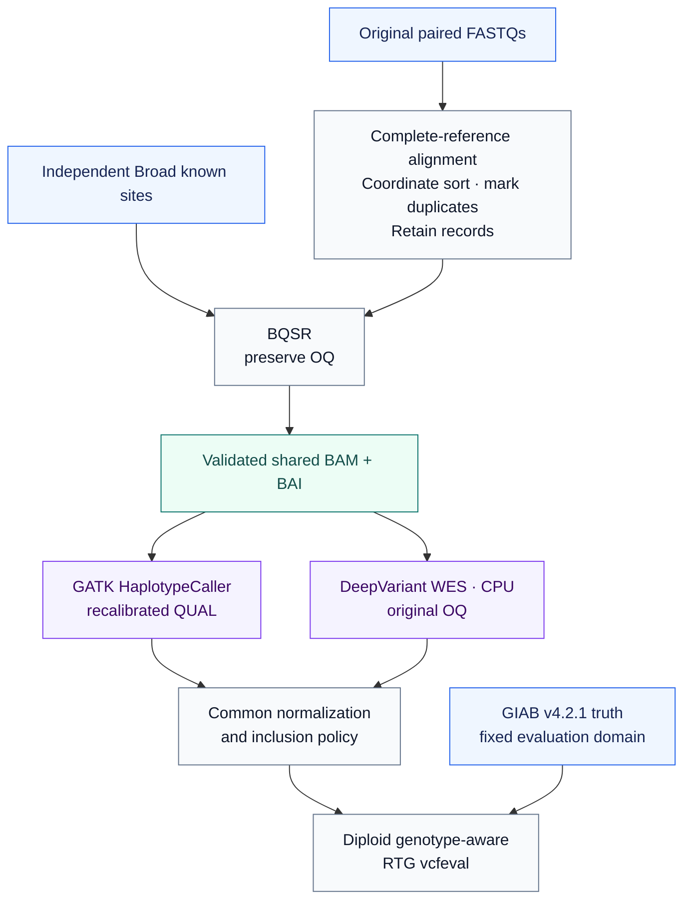
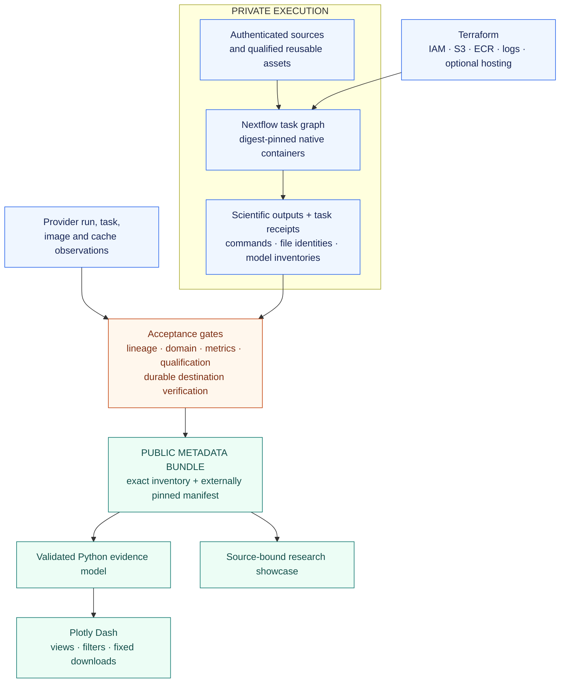

<div align="center">

# GIAB HG001 WES

### Dual-caller benchmarking · Immutable evidence · Interactive exploration

**One shared BAM. Two variant callers. A traceable path from source bytes to results.**

[](https://github.com/jcollins-bioinfo/giab-wes-nextflow/actions/workflows/ci.yml)
[](https://github.com/jcollins-bioinfo/giab-wes-nextflow/actions/workflows/aws-cloud.yml)
[](https://github.com/jcollins-bioinfo/giab-wes-nextflow/actions/workflows/explorer.yml)
[](LICENSE)

[Explore locally](#explore-locally) · [Scientific design](#scientific-design) · [Architecture](#architecture) · [Evidence and readiness](#evidence-and-readiness) · [Documentation](#documentation)

</div>

A **Nextflow** workflow and **Plotly Dash** application for comparing GATK HaplotypeCaller and DeepVariant WES against Genome in a Bottle benchmarks. The project connects authenticated original inputs, shared preprocessing, a prespecified evaluation domain, genotype-aware benchmarking, and validated evidence that can be inspected independently of the analysis runtime.

The first intended scientific result is an **HG001 chr20–22 coding-domain comparison**. Both callers receive the same physical BAM, BAI, reference, and calling-region bytes. Their outputs pass through a common normalization and benchmarking policy; the Explorer renders accepted observations without recalculating biological metrics in callbacks.

> [!IMPORTANT]
> **HG001 comparison results are not yet available.** Managed native qualification and complete-reference index construction have completed, but they are preliminary evidence. Full production-workflow and cache qualification, durable asset acceptance, and the real HG001 comparison remain pending. Synthetic results are always identified as synthetic.

This is independent, nonclinical research software inspired by nf-core conventions. It is not an official nf-core pipeline or a replacement for Sarek. Somatic and Oxford Nanopore analysis are outside the initial scope.

## At a glance

| Project choice | Purpose |
|---|---|
| **Authenticated original HG001 reads** | Preserve source-byte identity and distinguish data lineage from interchangeable downloads. |
| **Complete GRCh38 no-alt alignment** | Align against all 195 declared reference contigs before restricting the calling domain. |
| **One shared, duplicate-retained, BQSR BAM** | Keep preprocessing and physical caller inputs directly comparable. |
| **A fixed coding-domain denominator** | Prevent coverage, callability, or observed variants from selecting the evaluation region. |
| **Digest-pinned native task containers** | Record the executable image and actual tool behavior at each scientific stage. |
| **Immutable evidence and explicit missingness** | Carry provenance, qualification, metric arithmetic, and unavailable measurements into the result consumer. |

## Evidence and readiness

**Verified snapshot: September 11, 2026 · Development package `0.5.0-dev.1`.**

The [managed preliminary evidence summary](docs/orchestration/evidence/managed-preliminaries-20260911.json) records the basis and limits of the current cloud milestones. It contains selected observations and receipt hashes; private provider records and scientific payloads remain outside Git.

| Evidence layer | Observed status | Interpretation |
|---|---|---|
| **Source acquisition** | All 16 required source receipts authenticated, including both original paired FASTQs. | Inputs are available in private storage; acquisition is not an analysis result. |
| **Full-reference indexing** | Three HealthOmics tasks completed: reference preparation, classical BWA index construction, and acceptance checks. Returned evidence reports complete base identity and functional-probe verification. | Native construction passed. Final durable destination verification and reusable-asset publication remain separate gates. |
| **Managed native qualification** | All 12 tasks completed on Nextflow 26.04.0. Both native callers, normalization, inclusion, compression, and RTG benchmarking executed on invented fixtures; 528 original-quality records were verified. | Establishes the tested nonhuman behavior. The receipt explicitly leaves full production-workflow and managed-cache qualification false. |
| **Historical M3–M5 qualification** | Retained Linux/x86_64 Docker and CI evidence for synthetic preprocessing, calling, benchmarking, and resume. | Applies to those fixtures and execution environments. |
| **Canonical HG001 comparison** | Not executed or accepted. | No HG001 accuracy, caller ranking, comparative cost, or clinical-performance result is claimed. |
| **Evidence Explorer** | Local synthetic views and strict canonical-bundle consumer implemented and tested. | Canonical readiness remains unavailable without an accepted, externally pinned bundle. |
| **Public application** | Hosting configuration exists; no hosted Explorer is verified. | The [research showcase](https://johnpatrickcollins.info/research/giab-wes-nextflow) presents the earlier synthetic evidence. |

CI badges describe repository checks. They do not attest to a canonical scientific result or a live deployment. The managed preliminary runs also do not replace execution of the full production DAG: the separate [full-DAG qualification workflow](scripts/qualification/cloud-dag.nf) and managed cache tests remain required.

## Scientific design

### Source material and reference

The input is the original paired Garvan HiSeq 2500 **`NIST7035_TAAGGCGA_L001`** HG001 exome dataset distributed through GIAB. `SRR3197785`, `SRX1608029`, `SRP012400`, and `PRJNA162355` document lineage; they do not authorize substitution of SRA-derived reads for the pinned original FASTQs.

The reference is **`GCA_000001405.15_GRCh38_no_alt_analysis_set`**, with all **195 declared contigs** authenticated. The canonical alignment path uses **classical BWA 0.7.17-r1188** with a complete-reference `bwtsw` index. Historical M3 BWA-MEM2 qualification is retained as a distinct implementation history.

Source checksums, expected executable reports, image digests, and model identities are versioned in the [source ledger](docs/source-ledger.yaml), [canonical asset contract](config/canonical-assets.json), and [tool contracts](#tool-and-runtime-contracts).

### Shared preprocessing and caller inputs



Duplicates are marked and retained. BaseRecalibrator and ApplyBQSR use independent Broad known-sites resources; **GIAB truth is not a BQSR input**. Original base qualities are retained in `OQ`.

| Shared physical inputs | Deliberate caller-specific behavior |
|---|---|
| Identical BAM and BAI hashes | GATK consumes recalibrated `QUAL`. |
| Identical reference and calling-region hashes | DeepVariant consumes retained `OQ` with the pinned CPU WES model. |
| Common normalization, inclusion, and evaluation policy | Caller outputs retain their own native and normalized identities. |

Equal BAM bytes do not imply identical effective quality inputs. The [OQ decision](docs/adr/0003-shared-bam-oq.md) and [scientific validity notes](docs/scientific-validity.md) make this distinction explicit. Real-sample original-quality equivalence still requires its own evidence; verification on an invented fixture does not establish it for HG001.

### Prespecified evaluation domain

The physical capture-kit assignment is unresolved. The selected design is therefore the fixed union of **GENCODE v50 Basic protein-coding CDS and stop-codon intervals**, with GIAB high-confidence regions defining evaluation eligibility.

```text
T_design       = union(protein-coding CDS, stop-codon intervals)
R_call         = merge(pad(T_design, 100 bases)) ∩ chr1–22,X
R_eval_full    = GIAB high-confidence regions ∩ T_design ∩ chr1–22
R_eval_holdout = R_eval_full ∩ chr20–22
```

| Domain | Bases | Intervals | Intended use |
|---|---:|---:|---|
| **`R_eval_holdout` · chr20–22** | **1,905,809** | **11,715** | First canonical comparison, using the chr20–22 portion of `R_call` after full-reference alignment. |
| `R_eval_full` · chr1–22 | 33,567,783 | 203,986 | Separate optional descriptive analysis; not an executed result. |

The constructor has reproduced the [approved domain identities](docs/orchestration/evidence/coding-domain-reproduced.json). Uncovered and uncaptured coding loci remain in the recall denominator. Depth, callability, query variants, and genotypes never choose that denominator. Accuracy-dependent interval selection, parameter tuning, stopping rules, and additional filters are excluded from the fixed experiment.

> [!NOTE]
> DeepVariant 1.10 WES training included HG001 replicates. Chr20–22 was excluded from documented training, so this scope supports **same-individual locus-held-out sensitivity**, not population generalization. Full-domain results would be descriptive/in-sample evidence. These are coding-domain measurements, not a claim that every intended capture target was assayed.

See the [domain decision](docs/adr/0013-approved-domain-colab-and-prototype.md) and [scientific interpretation](docs/scientific-validity.md). No scalar winner, caller-superiority, or clinical claim is inferred.

### Benchmark semantics

Both callers use BCFtools normalization and the same inclusion policy before diploid genotype-aware RTG `vcfeval`. The result model preserves separate query-side and truth-side true-positive counts:

```text
precision = tp_query / (tp_query + fp)
recall    = tp_truth / (tp_truth + fn)
f1        = 2 × precision × recall / (precision + recall)
```

SNP, INDEL, and OTHER categories retain their own counts and missingness. Undefined metrics remain `null` with an explicit reason; zero precision and recall produce zero F1. Query and truth representations are not assumed to have interchangeable true-positive counts. The [public result contract](docs/canonical-results-contract.md) defines the exact arithmetic and validation rules.

## Architecture

**Terraform provisions infrastructure. Nextflow orchestrates computation. Python validates evidence. Dash presents it.**



Each cloud scientific tool runs directly in its own container. Scientific tasks do not nest Docker, Apptainer, Podman, or udocker. Native observations preserve commands, timestamps, declared images, requested resources, file identities, tool-version output, and DeepVariant model inventories. Those observations still require joins to actual provider task and image records.

The public adapter validates a pinned private inventory before producing a fresh metadata bundle. The consumer independently checks the exact file inventory, byte lengths, hashes, scientific scope, caller symmetry, qualification receipts, metric arithmetic, and missingness against an **externally supplied manifest SHA-256**. A self-consistent replacement manifest alone is insufficient.

Raw FASTQs, BAMs, VCFs, references, truth sets, credentials, private paths, account details, and Terraform state stay outside Git and the public bundle. Publishing and recovery use rehashed artifacts and completion markers written last. Read the [architecture](docs/architecture.md), [publication contract](docs/canonical-results-contract.md), and [private-workspace policy](docs/private-workspace.md).

## Explore locally

### 1. Open the Evidence Explorer

Use **Python 3.12 or 3.13** for the tested combined pipeline/Explorer setup. From the repository root:

```bash
python -m venv .venv
source .venv/bin/activate
python -m pip install . ./explorer

gunicorn pipeline_evidence_explorer.wsgi:server \
  --bind 127.0.0.1:8050 --workers 1 --no-control-socket
```

Open **[localhost:8050/giab-wes-nextflow/](http://127.0.0.1:8050/giab-wes-nextflow/)**. This route uses bundled synthetic evidence and needs neither AWS credentials nor human genomic data.

| Explorer view | What it exposes |
|---|---|
| **Overview** | Retained synthetic preprocessing and caller/benchmark qualification, with explicit evidence labels. |
| **Execution** | Filterable traces and available runtime/resource observations, preserving original units. |
| **Provenance and downloads** | Source and artifact identities; synthetic JSON and canonical JSON/TSV exports after acceptance. |
| **Canonical results** | Availability, scope, caller metrics, lineage, qualification, limitations, and missing measurements after strict bundle acceptance. |

Callbacks select and render validated observations. They do not launch analysis, fetch private genomic storage, or recompute biological metrics. The [five-minute demonstration](DEMO.md) and [Explorer guide](explorer/README.md) provide a guided route.

<details>
<summary><strong>Readiness, accepted bundles, and deployment boundaries</strong></summary>

Under the default `/giab-wes-nextflow/` prefix:

| Endpoint | Meaning |
|---|---|
| `healthz` | Process liveness. |
| `readyz` | Validated synthetic-bundle readiness; canonical status remains false. |
| `canonical/readyz` | Accepted canonical-bundle readiness; returns 503 when absent or invalid. |
| `canonical/evidence.json` | Fixed validated canonical metadata export. |
| `canonical/metrics.tsv` · `canonical/resources.tsv` | Fixed metric and resource exports. |

Canonical import requires both `EXPLORER_CANONICAL_BUNDLE` and an independently reviewed `EXPLORER_CANONICAL_MANIFEST_SHA256`. `EXPLORER_PREFIX` selects a validated alternate route prefix.

The [Explorer image](explorer/Dockerfile) runs as a non-root user and supports a read-only filesystem with writable `/tmp`. The separate [Lightsail hosting module](infra/hosting-lightsail/README.md) targets one memory-qualified service. Final accepted-evidence memory/callback measurements, provider HTTPS verification, and custom-domain DNS/TLS verification are still required. No live hosted Explorer URL is claimed.

</details>

### 2. Run the nonhuman foundation fixture

A working Docker engine, **Nextflow ≥26.04.6**, and **Java ≥17** are required for the local baseline. From the repository root:

```bash
python tests/data/generate_fixture.py
nextflow run . -profile test,docker
```

This small invented fixture exercises the foundation workflow. It does **not** execute the GATK/DeepVariant comparison. Native caller qualification uses a qualified Linux/x86_64 environment; DeepVariant CPU additionally requires SSE4.1, SSE4.2, and AVX. Python tests on Apple Silicon do not establish native caller execution.

### 3. Develop and validate

```bash
python -m pip install -r requirements-dev.txt
python -m pip install -e '.[aws]' ./explorer
python -m pytest -q tests/unit explorer/tests
python scripts/validate_contracts.py
```

The optional AWS extra installs the SDK and browser-login dependency; installation does not authenticate or deploy. Follow [testing](docs/testing.md), [data contracts](docs/data-contracts.md), and [contribution guidelines](CONTRIBUTING.md) for workflow-specific checks.

## Execution paths

| Path | Entry point | Current role |
|---|---|---|
| **Local development and synthetic qualification** | [`main.nf`](main.nf), [`m5.nf`](m5.nf) | Foundation and staged synthetic integration with retained native-tool evidence. |
| **Canonical Colab workflow** | [`canonical.nf`](canonical.nf), [notebook launch center](notebooks/README.md) | Exact-source launcher, runtime and asset guards, private durable recovery. No accepted HG001 result. |
| **AWS HealthOmics** | [`cloud.nf`](cloud.nf), [qualification workflows](scripts/qualification) | Selected managed backend. Native and index preliminaries completed on exact Nextflow 26.04.0; full production and cache qualification pending. |
| **AWS Batch** | [`cloud.nf`](cloud.nf), [AWS Terraform](infra/aws/README.md) | Implemented alternative with separate job roles and verified definition identities; not executed. |

### Managed cloud execution

The applied foundation provides separate protected private S3 buckets for durable data and disposable work, private ECR repositories, service roles, and execution logs. Workflow packages bind source, inputs, images, domains, and parameters. Source acquisition preserves exact pinned bytes; multipart ETags are not SHA-256 identities.

[Bounded run supervision](docs/aws-run-watchdog.md) reserves resources before submission, binds control to the exact request, retains failed-attempt history, and checks observed resources and server limits. Account-specific configuration, financial limits, and authorization remain private. Alerts and application-side monitoring are not provider billing caps.

Routine automation requires temporary assumed-role credentials. Backend preflight preserves denied or unavailable observations as unknown. The managed Nextflow **26.04.0** qualification is specific to its observed cases; the local production version guard is not broadly lowered. See [engine qualification](docs/nextflow-26.04.0-qualification.md).

Caller task inputs exclude truth. Batch ordinary-role restrictions and workflow-wide HealthOmics permissions have different isolation properties; truth copies in shared work storage prevent a stronger adversarial-isolation claim. Hosting is a separate deployment concern: Lightsail is the selected serving route, while optional Fargate/ALB code remains disabled.

For operations, use [AWS execution](docs/aws-cloud.md), [CLI/API details](scripts/aws/README.md), and [Terraform configuration](infra/aws/README.md). The commands in the local quickstart do not submit cloud analysis.

### Colab and durable recovery

The [canonical Run-all notebook](notebooks/canonical_hg001_analysis_colab.ipynb) binds installation to a reviewed source SHA, authenticates inputs, qualifies the actual runtime, and checks reference/index/known-sites assets before analysis. Active scratch and Nextflow work remain under `/content`, outside Drive; Drive holds durable project artifacts rather than active work directories.

Restart rehashes sources, reusable assets, and completed stages before reuse. Source, reference, code, backend, image, domain, and relevant parameter changes invalidate the corresponding identity. Cache reuse is recorded separately from new uncached compute. See [canonical operations](docs/canonical-analysis.md), [asset provenance](docs/canonical-assets.md), [runtime qualification](docs/canonical-runtime.md), and [M2 recovery](docs/m2-recovery.md).

## Tool and runtime contracts

Versions describe the pinned project contracts, not recommendations to replace them with newer releases. Actual image, executable, architecture, and model observations are required during execution.

| Component | Contract | Source of truth |
|---|---|---|
| Canonical alignment | Classical BWA 0.7.17-r1188; full-reference `bwtsw` index | [Canonical assets](config/canonical-assets.json) |
| Shared preprocessing | SAMtools 1.24; GATK 4.7.0.0; retained duplicates and OQ | [M3 tools](config/m3-tools.json), [M4 tools](config/m4-tools.json) |
| GATK caller | HaplotypeCaller 4.7.0.0; recalibrated QUAL | [M4 caller contract](config/m4-tools.json) |
| DeepVariant caller | 1.10.0; CPU WES model; retained OQ | [M4 caller/model contract](config/m4-tools.json) |
| Common downstream | BCFtools 1.24; RTG Tools 3.13 | [M5 tools](config/m5-tools.json) |
| Workflow runtime | Local baseline ≥26.04.6; exact managed 26.04.0 preliminaries | [Nextflow config](nextflow.config), [engine investigation](docs/nextflow-26.04.0-qualification.md) |
| Evidence application | Python, Plotly Dash, Gunicorn; separate package | [Explorer package](explorer/pyproject.toml) |

Historical BWA-MEM2 distribution 2.3 reports executable version 2.2.1 for its pinned image. Both identities are retained in the M3 contract; they are not substituted for the canonical classical-BWA identity.

## Validation and remaining milestones

The project separates contract tests, real synthetic execution, managed preliminary execution, and accepted scientific results. The [execution matrix](docs/execution-matrix.md) and retained evidence records provide the detailed history.

| Retained evidence | What it establishes |
|---|---|
| [M3 preprocessing](docs/orchestration/evidence/m3-verified.json) | Invented-read preprocessing, BAM/index/OQ acceptance, and completed versus cached tasks. |
| [M4 callers](docs/orchestration/evidence/m4-verified-main-34237377774.json) | Native GATK and DeepVariant synthetic SNVs, inference, independent/both-mode agreement, and resume. |
| [M5 benchmarking](docs/orchestration/evidence/m5-verified-34270789172.json) | Fixed synthetic SNP/indel representations, common normalization, RTG counts, and resume. |
| [Managed preliminaries](docs/orchestration/evidence/managed-preliminaries-20260911.json) | Completed native nonhuman qualification and full-reference index tasks, with explicit acceptance limits. |
| [Pipeline CI](.github/workflows/ci.yml), [cloud validation](.github/workflows/aws-cloud.yml), [Explorer checks](.github/workflows/explorer.yml) | Repository-specific contracts, synthetic integrations, infrastructure validation, and application/image checks. |

Scientific timings and resource observations retain their original execution context. Synthetic performance does not estimate real WES performance; completed managed preliminaries do not establish production-workflow readiness.

The path to the first accepted result is:

1. **Complete durable asset acceptance:** verify returned full-reference/index bytes and qualify the independent known-sites derivatives.
2. **Qualify the complete managed workflow:** execute the actual production process graph on its separate nonhuman fixture and test unchanged reuse plus cache-invalidation cases.
3. **Run the fixed HG001 experiment:** establish all real-sample preprocessing and original-quality proofs, then execute both callers and common benchmarking.
4. **Accept and publish evidence:** bind provider task/image/cache records, scientific lineage, durable outputs, and the externally reviewed public manifest.
5. **Deliver the accepted result:** load the bundle into the Explorer, measure the final image under traffic, verify hosting, and update the source-bound research page.

Until those gates pass, canonical metrics and canonical readiness remain unavailable. Infrastructure changes, a completed preliminary run, and a working synthetic interface cannot substitute for those receipts.

## Documentation

| If you want to… | Start here |
|---|---|
| Understand the experiment and its limitations | [Scientific validity](docs/scientific-validity.md) · [Domain decision](docs/adr/0013-approved-domain-colab-and-prototype.md) |
| Trace design decisions and stage boundaries | [Architecture](docs/architecture.md) · [Data contracts](docs/data-contracts.md) |
| Inspect the evidence interface | [Canonical result contract](docs/canonical-results-contract.md) · [Cloud public adapter](src/giab_wes_nextflow/cloud_public.py) |
| Run the local demonstration | [Demo guide](DEMO.md) · [Explorer documentation](explorer/README.md) |
| Operate Colab analysis and recovery | [Notebook launch center](notebooks/README.md) · [Canonical operations](docs/canonical-analysis.md) |
| Operate the managed backend | [AWS guide](docs/aws-cloud.md) · [Watchdog](docs/aws-run-watchdog.md) · [CLI/API](scripts/aws/README.md) |
| Review infrastructure and serving | [AWS Terraform](infra/aws/README.md) · [Lightsail hosting](infra/hosting-lightsail/README.md) |
| Review validation and history | [Testing](docs/testing.md) · [Execution matrix](docs/execution-matrix.md) · [Changelog](CHANGELOG.md) |
| Contribute or report a security issue | [Contributing](CONTRIBUTING.md) · [Security policy](SECURITY.md) |

Some linked design and execution documents are historical snapshots. Their dates and evidence identities determine what they establish; the readiness table above summarizes the current verified milestone.

## Attribution and license

Developed by **John Patrick Collins**. Project code is released under the [MIT License](LICENSE); upstream datasets, tools, and container images retain their own licenses and attribution requirements.

Use [CITATION.cff](CITATION.cff) to cite the software and record the exact commit, configuration, and accepted evidence-manifest identity for any analysis. Primary data and method references are maintained in the [source ledger](docs/source-ledger.yaml), including [Genome in a Bottle](https://www.nist.gov/programs-projects/genome-bottle), the reference, annotation, callers, and benchmarking tools.

<div align="center">

[Back to top](#giab-hg001-wes)

</div>
