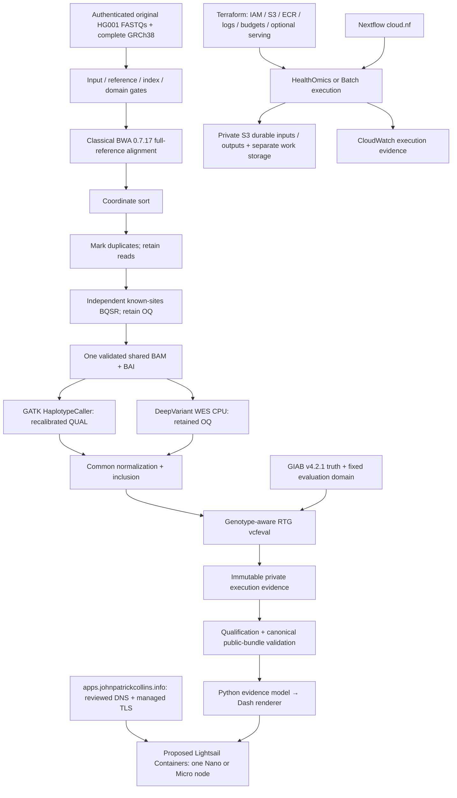

[](https://github.com/jcollins-bioinfo/giab-wes-nextflow/actions/workflows/ci.yml)
[](https://github.com/jcollins-bioinfo/giab-wes-nextflow/actions/workflows/aws-cloud.yml)

# GIAB HG001 WES: Dual-caller Benchmark and Evidence Explorer

A reproducible, nonclinical comparison of **GATK HaplotypeCaller and DeepVariant
WES** from one shared analysis-ready BAM, with authenticated inputs, fixed
benchmarking domains, immutable execution evidence and a Plotly Dash viewer.
[Genome in a Bottle (GIAB)](https://www.nist.gov/programs-projects/genome-bottle)
provides the HG001 reference material and benchmark resources.

**The first canonical result is the HG001 chr20–22 fixed coding-domain benchmark.
That result has not yet been produced or accepted.** M3 preprocessing, M4 caller
execution and M5 normalization/benchmarking have retained synthetic Linux/x86_64
Docker qualification. Their results establish the tested synthetic behavior;
they do not establish HG001 accuracy, comparative cost or clinical performance.

The repository now includes an exact-SHA Colab canonical launcher and a separate
cloud-native Nextflow path targeting AWS HealthOmics and AWS Batch, together with
Terraform infrastructure and an Explorer container/serving definition. Cloud
implementation is partial and remains gated. Seven AWS service IAM roles were
created in a separately authorized bootstrap and imported without changes. The
33-resource foundation is applied: two protected private S3 buckets, eight ECR
repositories, three log groups and their policies. Two bounded HealthOmics
qualification workflows and run groups are registered. Input staging is active;
no cloud scientific run or hosted Explorer has executed in this snapshot.

This is an independent, nf-core-inspired project, not an official nf-core
pipeline or a Sarek replacement. ONT and somatic analysis are outside v1.

## Current readiness

Snapshot: **2026-09-11 UTC / September 10 MDT**, development package
`0.5.0-dev.1`. [PR #27](https://github.com/jcollins-bioinfo/giab-wes-nextflow/pull/27)
is merged into main at `e291340f19dd7a55df8eda89258dcabd70fd41f4`.
Its [pipeline CI](https://github.com/jcollins-bioinfo/giab-wes-nextflow/actions/runs/34503809951)
and [cloud validation](https://github.com/jcollins-bioinfo/giab-wes-nextflow/actions/runs/34503809921)
succeeded. This continuation uses branch `codex/giab-execution-economical`.
Historical CI, current local checks, cloud execution and a deployed application
are distinct evidence layers. The continuation has not produced canonical results.

| Path / capability | CODED | VALIDATED | DEPLOYED | EXECUTED |
|---|---|---|---|---|
| Historical M3–M5 synthetic Linux Docker workflows | Yes | Retained native-tool, isolation and resume evidence | CI environment only | Yes, invented fixtures |
| Local Python / Explorer synthetic views | Yes | Unit, contract and source HTTP checks | Local development only | Yes, metadata/synthetic views |
| Colab canonical HG001 workflow | Yes | Local guards, contracts, stubs and collector tests | Launcher available; runtime qualification pending | No accepted HG001 run |
| AWS HealthOmics canonical path | Partial | Local checks; exact 26.04.0 Docker probes passed for v1 and v2 | Native and full-reference-index qualification workflows/groups registered | No cloud scientific run yet |
| AWS Batch canonical path | Partial | Local contracts, job-definition checker and Terraform checks | No compute environment/queue/jobs created | No cloud scientific run |
| AWS project IAM service roles | Yes | Trust and inline policies read back | Seven service roles created | No workload execution implied |
| Explorer economical hosting | Lightsail route and bounded image memory probe implemented | 512 MiB Linux probe: 94,502,912-byte peak, no OOM; synthetic bundle only | No; deferred while science is prioritized | No hosted service |
| Explorer on ECS Fargate / ALB / ACM | Retained optional code | Historical source HTTP/Terraform checks | Disabled | No hosted service |
| Human operator access | Scoped role and temporary browser login | CLI and boto3 assumed-role identity verified | `giab-operator` created | Read-only preflight completed |

The cloud DAG runs scientific tools directly in their own task containers.
Its collector currently emits **private `cloud_scientific_evidence` with
`canonical: false`**, pending backend qualification and the canonical public-bundle
adapter. Infrastructure code, a registered workflow, synthetic success and an
accepted HG001 result are separate states. See [AWS readiness and operations](docs/aws-cloud.md)
and [historical execution evidence](docs/execution-matrix.md).

## Scientific design and interpretation

The experiment is fixed before observing caller accuracy:

- **Input:** original paired Garvan HiSeq 2500 `NIST7035_TAAGGCGA_L001` FASTQs
  acquired directly from GIAB. SRR3197785/SRX1608029/SRP012400/PRJNA162355 are
  lineage identifiers, not permission to substitute SRA-derived reads.
- **Reference and alignment:** complete authenticated
  `GCA_000001405.15_GRCh38_no_alt_analysis_set`, including all 195 declared contigs;
  full-reference alignment with **classical BWA 0.7.17**. Historical M3 synthetic
  BWA-MEM2 evidence remains unchanged and is a distinct implementation history.
- **Shared preprocessing:** coordinate sort, duplicate marking with records
  retained, BaseRecalibrator and ApplyBQSR using independent Broad known-sites
  resources, retaining original qualities in OQ. GIAB truth is not a BQSR input.
- **Caller symmetry:** both callers receive the same accepted physical BAM/BAI,
  reference and calling-region byte identities. GATK uses recalibrated QUAL;
  DeepVariant uses retained OQ with its pinned CPU WES model. Equal BAM bytes do
  not mean identical effective quality inputs.
- **Common downstream policy:** BCFtools normalization and shared inclusion
  rules, followed by diploid genotype-aware RTG `vcfeval` against GIAB v4.2.1.
  Both callers use the same fixed evaluation denominator. No accuracy-dependent
  interval selection, parameter tuning, stopping rule or extra filter is allowed.

The owner-approved alternative to unresolved physical capture-kit assignment is
**GENCODE v50 Basic protein-coding CDS plus stop codon**. Its definitions are:

```text
T_design       = fixed union of protein-coding CDS and stop-codon intervals
R_call         = merge(pad(T_design, 100 bases)) ∩ chr1–22,X
R_eval_full    = GIAB high-confidence regions ∩ T_design ∩ chr1–22
R_eval_holdout = R_eval_full ∩ chr20–22
```

The first run uses the chr20–22 portion of `R_call` after full-reference alignment.
`R_eval_holdout` contains **1,905,809 bases in 11,715 intervals**; the full approved
coding domain contains **33,567,783 bases in 203,986 intervals**. The constructor
has reproduced the approved hashes. Uncovered and uncaptured coding loci remain
in the recall denominator; depth, callability, query variants and genotypes never
choose that denominator. These are coding-domain results, not an assertion that
every intended exome capture target was assayed.

DeepVariant 1.10 WES training included HG001 replicates. Chr20–22 was excluded
from documented training and provides **same-individual locus-held-out
sensitivity**, not population generalization. Full-domain results would be
separate, descriptive/in-sample evidence. There is no scalar winner, caller
superiority or clinical claim. Read [scientific validity](docs/scientific-validity.md),
[the approved domain decision](docs/adr/0013-approved-domain-colab-and-prototype.md),
[OQ policy](docs/adr/0003-shared-bam-oq.md) and [the result contract](docs/canonical-results-contract.md).

## Architecture

**Terraform provisions infrastructure; Nextflow orchestrates scientific computation.**
The Colab path retains its package-managed runtime and `/content` qualification.
The cloud entrypoint decomposes execution into direct scientific task containers;
it does not nest Docker, Apptainer, Podman or udocker inside AWS scientific tasks.



`canonical.nf` and `canonical_run.py` own the established Colab route. `cloud.nf`
and `modules/local/cloud/` own the separate AWS route. Python validates identity,
scientific contracts and evidence using shared tested functions; the Explorer
only filters/renders validated observations and exports. Its callbacks do not
recalculate biological metrics. [Architecture detail](docs/architecture.md)
explains these responsibilities and their current qualification boundaries.

## Start locally without AWS

Use Python **3.12 or 3.13** for the tested development environments. Nextflow
requires **>=26.04.6** and Java **>=17**. Native synthetic biological execution
requires a qualified Linux/x86_64 Docker environment; DeepVariant CPU also
requires SSE4.1, SSE4.2 and AVX. Python tests on Apple Silicon are not native
DeepVariant qualification.

```bash
python -m venv .venv
source .venv/bin/activate
python -m pip install -r requirements-dev.txt
python -m pip install -e '.[aws]' ./explorer
python -m pytest -q tests/unit explorer/tests
python scripts/validate_contracts.py
```

The AWS extra installs the SDK and its required CRT browser-login dependency;
it does not authenticate or contact AWS. To run
the small nonhuman foundation fixture with a working Docker engine:

```bash
python tests/data/generate_fixture.py
nextflow run . -profile test,docker
```

Foundation and M3 modes do not call GATK HaplotypeCaller or DeepVariant.
Samplesheets are lane-aware, validate read-group/platform-unit uniqueness and
mate identity, and fix the platform to `ILLUMINA`. `--callers gatk`, `deepvariant`
and `both` select caller branches where that workflow implements them.
See [testing](docs/testing.md) and [data contracts](docs/data-contracts.md).

## Canonical Colab execution and durable assets

Use the [notebook launch center](notebooks/README.md) and
[canonical Run-all notebook](notebooks/canonical_hg001_analysis_colab.ipynb).
The launcher binds installation to a reviewed implementation SHA, authenticates
sources, checks the actual host, qualifies representative callers and validates
the full reference, BWA index and independent BQSR resources before analysis.
Reference base identity and sampled functional index probes are separate gates.

Active scratch and Nextflow work stay under `/content`, outside Drive. Durable
sources, qualified assets and completed stages use only the established private
project root `/content/drive/MyDrive/giab-wes-nextflow-private`. Drive is never a
Nextflow work directory. Planning allowances are approximately 100 GiB active
scratch and 60 GiB durable capacity; actual free space and incremental copy
requirements are checked. Several hours is an allowance, not a measurement.

Restart rehashes authenticated caches and completed stages before reuse. A changed
source, reference, code, backend or relevant parameter invalidates its identity;
cache reuse is not new uncached compute. Keep existing caches after interruption.
See [canonical operations](docs/canonical-analysis.md), [asset provenance](docs/canonical-assets.md),
[runtime qualification](docs/canonical-runtime.md) and [M2 recovery](docs/m2-recovery.md).
The canonical Colab path is implemented but has no accepted real HG001 result.

## AWS execution, infrastructure and authentication

The default region is **us-west-2**. HealthOmics provides managed genomics/Nextflow
execution; Batch provides general-purpose cloud/HPC portability and explicit
infrastructure control. They implement the same experiment and neither is
scientifically superior. DNS setup is independent of scientific execution.

| Component | Implemented behavior and current boundary |
|---|---|
| HealthOmics | Deterministic workflow ZIP, private ECR mapping validation, explicit registration/run-group/cache operations, input-bound run plans, guarded submission and run/task/cache evidence export. Two qualification workflows registered; no run executed in this snapshot. |
| Batch | Managed x86-only EC2 environment, zero minimum vCPUs, bounded retries, task-specific resources, durable S3 work, ten immutable-revision job definitions and live read-only image/role verification. Disabled by default. |
| S3 | Separate private encrypted/versioned durable-data and disposable-work buckets, public access blocked, TLS required, lifecycle restricted to disposable work; canonical evidence has no expiry rule. |
| ECR | Eight immutable/scanned private repositories: support, Explorer and six reviewed tool mirrors. Mirrors must preserve upstream digest provenance. No automatic deletion of potentially referenced images. |
| IAM | Separate Batch ordinary/benchmark/execution/instance, HealthOmics execution and Explorer execution/runtime roles. No AdministratorAccess; bundled-evidence Explorer runtime has no AWS permissions. |
| Observability / costs | CloudWatch log groups and optional budget alerts, project tags, explicit resource ceilings and storage lifecycle. Budget alerts do not stop spending; Batch may exceed its configured vCPU ceiling by one instance. |
| Explorer serving | Optional ECS Fargate, ALB, ACM and external-DNS or delegated-subdomain Route53 configuration. Disabled until separately authorized; no NAT Gateway by default. |

HealthOmics is the selected managed backend for qualification. Deployment
operators must inspect their own service quotas before submitting workloads;
capacity limits are not requested concurrency. No cloud scientific run or hosted
Explorer is established in this snapshot.

AWS documents exact Nextflow **26.04.0** and selectable `v1`/`v2` parsers.
The existing 26.04.6 floor came from the historical qualified baseline, not a
proven biological requirement. An isolated exact-engine investigation now records
parameter/reference/domain/content cache probes and tuple-output staging.
Both parsers passed all eight local Docker cases at commit
`be07180a16ea3e8aaa06c72c4bc10faa5d64e4f5`, including a container-identity
change and same-size/same-mtime input mutation. The support image now supplies
`ps` through `procps` for Nextflow task metrics. Managed cache semantics and native
GATK/DeepVariant execution still require managed qualification. The production version guard remains in
place; no broad downgrade is claimed. See [engine investigation](docs/nextflow-26.04.0-qualification.md).
Backend preflight separates EC2 and HealthOmics conditions and preserves unknown
state for denied reads. Unrelated discovery failures cannot imply absent resources.

Use temporary credentials to assume a project-scoped operator role. Routine
work must reject root and direct IAM-user identities. Keep account identifiers,
login configuration, authorization decisions and Terraform state outside Git.
The seven service roles and their six inline policies were imported unchanged;
review live drift before reconciliation.

```bash
aws sts get-caller-identity --profile giab-operator --region us-west-2
python scripts/aws/preflight.py --profile giab-operator --region us-west-2 \
  --backend healthomics --desired-vcpus 32 --json work/aws-preflight.json
```

The hosting module admits one memory-qualified Lightsail service. Activation
requires a reviewed plan and private deployment approval. Fargate and ALB
serving remain disabled. Configure financial limits and account-specific
authorization outside the public repository.

Offline package creation is already available:

```bash
python scripts/aws/healthomics.py --output work/package-evidence.json package \
  --zip work/healthomics-workflow.zip
```

The inspection/package commands do not deploy. The owner has authorized bounded
execution, but every paid launch still requires its explicit flag and verified
scientific, infrastructure and cost prerequisites. Authentication always rehashes staged source
bytes; multipart S3 ETags are not SHA-256 identities. Cache identity binds source,
workflow package, container digests, inputs/reference/domain and parameters.
API-reported hits, misses and unknowns stay distinct from new compute measurements.

Caller task inputs exclude truth. Ordinary Batch roles deny the durable truth
prefix; benchmark roles admit it. This does not establish adversarial isolation
for truth copies in shared Nextflow work storage or the workflow-wide HealthOmics
role. No stronger cloud isolation claim is made.

Follow [AWS execution](docs/aws-cloud.md), [Terraform setup/imports](infra/aws/README.md)
and [operator CLI/API details](scripts/aws/README.md) for the reviewed plan. No
Terraform apply, large genomic upload, image push, paid genomics run or hosted
Explorer deployment is claimed. The selected economical hosting path must remain separate from disabled
Fargate/ALB code. Storage, logs and image retention remain independently billable.

## Pipeline Evidence Explorer

The local synthetic application presents retained M3/M4/M5 evidence, provenance,
execution traces and downloads. Start it from the installed environment:

```bash
gunicorn pipeline_evidence_explorer.wsgi:server \
  --bind 127.0.0.1:8050 --workers 1 --no-control-socket
```

Open [the local Explorer](http://127.0.0.1:8050/giab-wes-nextflow/).
Its `healthz`/`readyz` endpoints distinguish liveness and synthetic evidence
readiness; `canonical/readyz` remains unavailable without an accepted canonical
bundle. Supplying both `EXPLORER_CANONICAL_BUNDLE` and an independently reviewed
`EXPLORER_CANONICAL_MANIFEST_SHA256` activates strict schema, hash, metric,
qualification and caller-symmetry validation before canonical rendering.

[`explorer/Dockerfile`](explorer/Dockerfile) builds a non-root amd64 image with
pinned base/dependencies; [`containers/support.Dockerfile`](containers/support.Dockerfile)
builds the separate Python validation image. Container CI is distinct from local
source checks. The target HTTPS route is
`https://apps.johnpatrickcollins.info/giab-wes-nextflow/`. The root path is a minimal
applications directory. Old `/research/giab-wes-nextflow/explorer/` links receive
method-preserving redirects. `EXPLORER_PREFIX` configures a validated alternate
prefix. The app has no analysis launch or private-storage access endpoint.
Managed HTTPS and exact DNS records must be verified after a provider URL works;
no live URL, DNS change or hosted service is claimed yet.
See [Explorer operation and HTTP interfaces](explorer/README.md).

## Evidence, validation and remaining work

Historical evidence is preserved rather than relabeled as a new run:

| Milestone | Retained qualification and limits |
|---|---|
| M2 recovery | [CI 34094504379](https://github.com/jcollins-bioinfo/giab-wes-nextflow/actions/runs/34094504379): Python 3.12/3.13 packaging, contracts and synthetic recovery checks. Historical source-cache metadata is not a fresh byte verification. |
| M3 | [Verified CI 34103737524](docs/orchestration/evidence/m3-verified.json): invented-read BWA-MEM2 preprocessing, BAM/index/OQ acceptance, 22 completed and 22 cached tasks. Distribution 2.3 reports 2.2.1; both identities remain recorded. |
| M4 | [Verified main CI 34237377774](docs/orchestration/evidence/m4-verified-main-34237377774.json): actual pinned GATK/DeepVariant WES synthetic SNVs, inference, isolation, independent/both equivalence and resume. Earlier RefCall failure evidence remains historical. |
| M5 | [Retained CI 34270789172](docs/orchestration/evidence/m5-verified-34270789172.json), followed by identical-tree main CI 34272289311: BCFtools 1.24, RTG 3.13, fixed synthetic SNP/indel counts and resume. These timings do not estimate canonical WES cost. |

The PR #27 development baseline recorded **409 passing pipeline/Explorer
tests**, Terraform formatting/validation and **five mock-provider tests**, clean
lint for both cloud Nextflow files, package build/inventory, pre-commit and
repository-hygiene checks. Full Nextflow lint retains two existing warnings.
These local results do not establish successful AWS execution. The initial cloud
CI built both images and exposed an HTTP startup race and a platform-specific
provider-lock omission. Bounded transport retries with three regression tests and
the official Linux provider hash address those failures; consult the exact-head
[PR checks](https://github.com/jcollins-bioinfo/giab-wes-nextflow/pull/27/checks)
for the corrected run (PR #27 is now merged). Existing CI is preserved;
[new cloud CI](.github/workflows/aws-cloud.yml) adds credential-free Terraform,
cloud contract/configuration and image build/health checks.

Before the first accepted cloud canonical result, complete these gates in order:

1. **Completed:** establish temporary non-root operator access and refresh account/quota state.
2. **Foundation applied:** 33 creates and 13 preserved IAM imports. Finish
   managed qualification of exact HealthOmics Nextflow 26.04.0; local Docker
   qualification is already complete for both parsers.
3. Build and qualify images; authenticate durable S3 assets. Cloud-native asset
   acquisition is active. The complete-reference classic-BWA workflow is
   registered but has not executed; known-sites cloud preparation remains
   incomplete. The canonical DAG consumes already-qualified assets.
4. Produce representative native cloud runtime qualification. Execute and audit
   the direct-container workflow, including restart/cache and resource evidence.
5. Implement and qualify the cloud canonical public-bundle adapter. Its current
   private collector is not that adapter. Validate the accepted manifest externally
   before Explorer import, public deployment or a scoped release candidate.

Human FASTQ/BAM/VCF/reference/truth data, credentials and large generated outputs
never belong in Git. The public result bundle contains only bounded validated
metadata, observations and artifact hashes; scientific files remain private.
See [private-workspace policy](docs/private-workspace.md), [publication contract](docs/canonical-results-contract.md),
[release readiness](docs/release-candidate-readiness.md), [milestones](docs/milestones.md)
and the dated [authoritative source ledger](docs/source-ledger.yaml).

## Demonstration and continuation

[DEMO.md](DEMO.md) provides a five-minute route and local
fallback. [The continuation checkpoint](docs/orchestration/execution-checkpoint.json)
records technical readiness, validation evidence and outstanding scientific gates.
M6 operational cloud qualification, M7 final release acceptance, M8 hosted
canonical evidence and M9 a live main-site update remain open. The website work
continues in [existing draft PR #33](https://github.com/jcollins-bioinfo/john-collins-bioinformatics/pull/33);
no automatic merge or final release is authorized.
