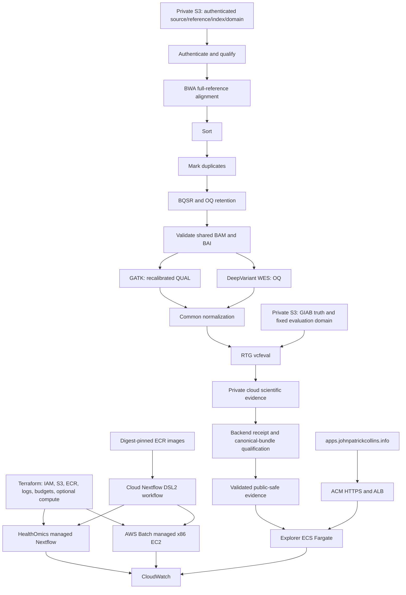

# AWS canonical execution and deployment

Terraform provisions infrastructure; Nextflow orchestrates scientific computation.

This implementation adds a separate `cloud.nf` direct-container path. The Colab
launcher, `/content` qualification, runtime discovery, historical evidence and
unschedulable `canonical_awsbatch` profile retain their existing semantics.
Scientific tools run as Nextflow task containers, without Docker-in-Docker,
privileged containers, Apptainer, Podman or udocker inside cloud tasks.

The first result remains the HG001 chr20–22 fixed coding-domain benchmark. The
original Garvan FASTQs, complete authenticated GRCh38 no-alt reference, classical
BWA 0.7.17, independent known-sites, retained duplicate records, BQSR/retained OQ,
GENCODE v50 Basic CDS plus stop codon design and GIAB v4.2.1 remain fixed.
GATK consumes recalibrated QUAL and DeepVariant CPU WES consumes retained OQ from
the same physical BAM/BAI lineage. Common normalization and genotype-aware RTG
vcfeval use the same fixed evaluation domain. No accuracy-dependent tuning,
winner, clinical or generalization claim is introduced.



## Readiness and hard gates

Cloud code and local unit/configuration checks are implementation evidence.
They do not qualify actual containers, an AWS deployment or HG001 results.
The cloud collector emits private `cloud_scientific_evidence` with
`canonical: false`; conversion into the existing closed canonical public bundle
requires backend-specific qualification, resource/cache/resume receipts and
independent review. The public schema and Explorer acceptance are unchanged.

HealthOmics and Batch coexist for portability of the same design. HealthOmics
offers managed genomics execution and can avoid the account's small EC2 quota;
Batch demonstrates explicit cloud/HPC infrastructure and resource control.
Neither backend is scientifically superior.

There is a current engine blocker: AWS documents HealthOmics Nextflow `26.04.0`
(`26.04` is its alias), while this repository requires `>=26.04.6`. The packaging
and run-plan utilities retain that minimum and block the incompatible engine.
An undocumented patch cannot be assumed. A future supported engine still needs
representative native scientific qualification. See the
[AWS engine settings](https://docs.aws.amazon.com/omics/latest/dev/starting-a-run.html).

The owner's pre-session EC2 On-Demand Standard quota observation was **5 vCPUs**,
quota `L-1216C47A`. It was not refreshed from root during development. Spot
`L-34B43A08` must be inspected independently. The read-only preflight reports both
and produces exact increase commands for the desired ceiling (default 32).
Quota sufficiency alone does not prove available capacity or unused headroom.
Terraform defaults to a disabled Batch environment and, when enabled, a 4-vCPU
ceiling; the default does not schedule the 8-CPU DeepVariant stage.

## Identity and one-time IAM bootstrap

Root is never a workload or Terraform operator identity. The operator explicitly
authorized a one-time IAM-only bootstrap on 2026-09-10. Seven service roles with
prefix `giab-wes-demo-` were created and their trust/inline policies re-read:
`batch-job`, `batch-benchmark-job`, `batch-execution`, `batch-instance`,
`healthomics-execution`, `explorer-execution`, and `explorer-task`.
No role received AdministratorAccess; Explorer's task role has no AWS permissions
for the initial bundled-evidence image. The authoritative policy template is
`infra/aws/iam-roles.json.tftpl`; import these roles before applying Terraform.

Service roles are assumed by their named services, not by a human operator.
The account had no human IAM users/roles at bootstrap. AWS prohibits root from
assuming a role; the connector also exposes no credential-switch operation.
Provision/select an approved non-root federated operator identity, sign in with
temporary credentials and reconnect AWS Core using that identity. Do not generate
root keys or widen service-role trust to bypass this requirement. See
[AWS role-switch requirements](https://docs.aws.amazon.com/IAM/latest/UserGuide/id_roles_use_switch-role-cli.html).

Terraform checks account identity and rejects root. Python deployment tooling
rejects root and non-assumed-role sessions before resource reads or mutations.
The IAM-only bootstrap does not authorize deployment, scientific data transfer,
workflow execution or ongoing root use.

## Data plane and isolation

The durable data bucket retains versioned `source/`, `reference/`, `index/`,
`domain/`, `known-sites/`, `truth/`, `results/`, `evidence/` and `provenance/`.
A separate disposable work bucket has bounded `work/` retention. Both block all
public access, encrypt objects and require TLS. Results and provenance have no
expiration rule. Cache retention is distinct from disposable Nextflow work.
S3 ETags, including multipart ETags, are never accepted as SHA-256 identities.

The manifest pins each object's exact size and SHA-256 and requires authenticated
full-reference, BWA-index, known-sites and runtime qualification receipts.
Reuse the authenticated reference and qualified BWA index durably; compute
startup must not trigger rebuilding an unchanged index. Initial acquisition,
cloud index construction/functional qualification and large S3 upload are still
operator work: no such bytes were transferred by this implementation session.

Caller task inputs exclude truth, confidence, benchmark outputs and other
caller outputs. S3 access to the durable truth prefix is denied to the ordinary
Batch job role and admitted to the benchmark role. This is not a claim of
adversarial IAM isolation for copies in shared Nextflow work storage or for the
workflow-wide HealthOmics service role. No truth-derived parameter enters callers.

Each scientific image retains its reviewed upstream digest. ECR mirrors must
preserve that digest and an explicit source/destination mapping. Build support
and Explorer images separately; no all-tools image is introduced. ECR retains
all digests because an untagged digest may still be referenced by a workflow
or deployed task. Any deletion requires a separate live-reference audit.

## Operator sequence

After non-root authentication and installing `.[aws]`:

```bash
python scripts/aws/preflight.py --region us-west-2 --desired-vcpus 32 \
  --project-prefix giab-wes --json work/aws-preflight.json
terraform -chdir=infra/aws init
# Import the seven bootstrapped IAM roles and six inline policies first:
# use the exact commands in infra/aws/README.md.
terraform -chdir=infra/aws plan -var-file=terraform.tfvars
python scripts/aws/healthomics.py package --zip work/healthomics-workflow.zip
```

The preflight returns nonzero while blockers remain; its JSON retains partial
observations and failures. Plan/ZIP creation does not submit a run. Review
[infrastructure setup and import](../infra/aws/README.md) and
[HealthOmics command details](../scripts/aws/README.md) before any later explicit
deployment. A separately authorized paid execution must first resolve the engine
or Batch quota, register/build verified images, authenticate all S3 inputs and
qualify the direct-container workflow. The current cloud collector cannot yet
produce a validated canonical public result bundle.

Call-cache identity binds workflow/package/source, immutable containers, all
scientific input/reference/domain hashes and relevant parameters. The tool
records hits/misses only when the API actually reports them; absent observations
stay unknown. Reused tasks never become new uncached compute measurements.

## Explorer, networking and costs

Build with `docker build --platform linux/amd64 -f explorer/Dockerfile .` from the
repository root. The image runs as UID 10001, uses Gunicorn, and supports a
read-only root filesystem with `/tmp` writable. Liveness and readiness retain
their existing prefix `/research/giab-wes-nextflow/explorer/`. Default readiness
qualifies synthetic evidence; `canonical/readyz` remains 503 without a reviewed
canonical bundle. Callbacks continue to filter/render validated observations.

The optional Fargate service uses an ALB/ACM HTTPS endpoint, image digest, log
group, circuit breaker and bounded desired count (default one when enabled).
Only the ALB can reach the task port. Public subnets avoid NAT Gateway fixed cost;
Batch has no inbound rule. Private subnets with deliberate endpoint/NAT budgeting
are a future hardening option, not an implicit deployment prerequisite.

ALB hours/LCUs, running Fargate tasks, public IPv4 addresses, Route53 zones,
CloudWatch ingestion/storage, ECR/S3 bytes and active EC2/EBS are billable.
Stopping compute does not remove ALB/zone/storage cost. A budget sends alerts;
it is not a spending cap. No NAT Gateway is provisioned. Exact costs require
regional pricing and observed usage; no fabricated canonical cost estimate is
provided.

Do not migrate the parent DNS zone. Terraform either creates only the delegated
`apps.johnpatrickcollins.info` zone and outputs its NS records, or outputs ACM
validation/ALB records for the existing external DNS provider. DNS is independent
of scientific execution. No parent-zone record was changed.

## Diagnosis and validation

Preserve Nextflow trace/report/timeline and task `.command.*` files before
retrying. Batch job attempts and CloudWatch streams distinguish scheduling,
image, OOM and tool failures. HealthOmics run/task evidence retains failure and
cache information. Check ECS stopped-task reasons, ALB target health and
Explorer readiness separately. Never retry checksum, reference, OQ or scientific
acceptance errors with altered biological parameters.

The added CI runs credential-free Terraform format/init/validate and mock-provider safety tests, cloud unit
tests, Nextflow 26.04.6 profile parsing/lint, and real linux/amd64 Docker image
build/health checks. Existing synthetic Docker CI and all existing workflows
remain in place. Local macOS Python/configuration checks do not substitute for
those Linux image checks or for an AWS run.
